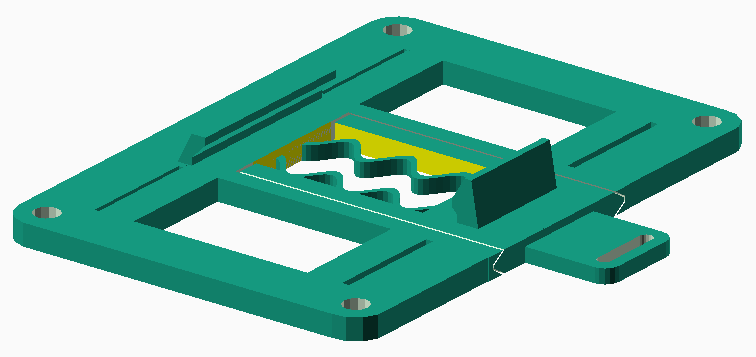
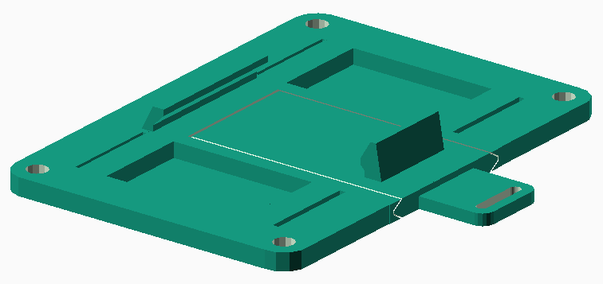
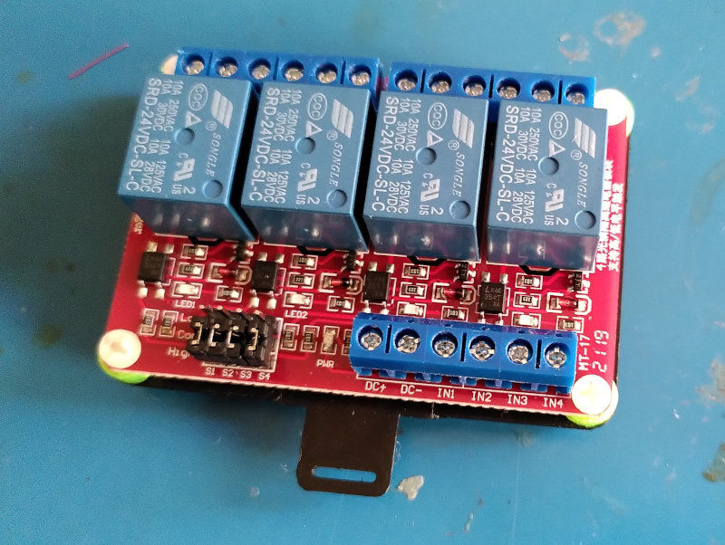
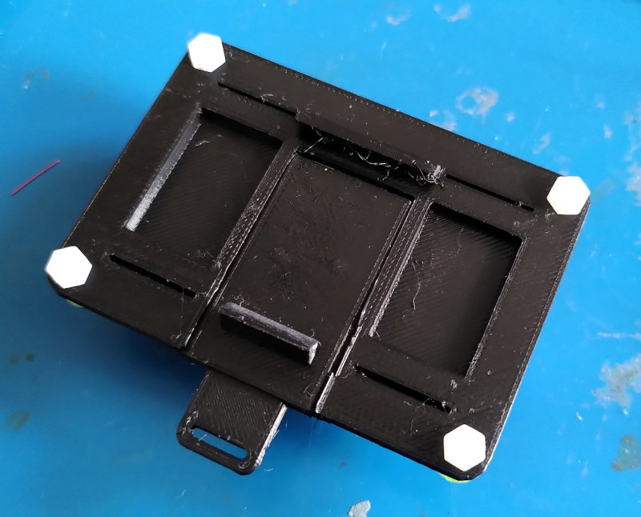
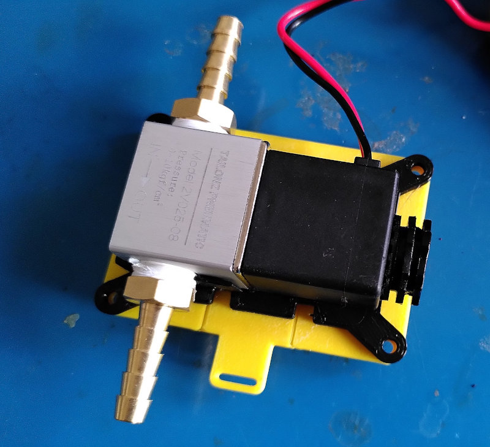
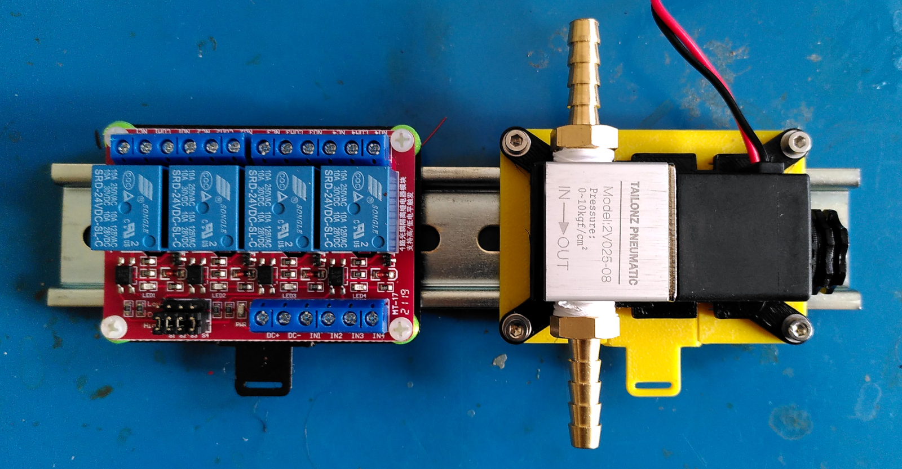

# Din-Rail ('Hutschiene') mount for components

Sizes (`screw_along` and `screw_across` as well as other parameters)
can be easily configured in openscad file.
Makefile generates the STL.

## Hardware
A spring and slider printed in place provides the clip-on action.

Since the slider is printed in place, make sure to not too elephant-foot
your first layer too much; might need to be opened up a bit after printing for
the slider to be free.

Can be printed with open or isolated bottom:

Open                        | Isolated
----------------------------|---------------
 | 

The spring and shape of the hook make it snap into place with a satisfying
click.

Printed in PLA, ABS and PETG and in all cases the spring-force is roughly
right (but can be configured with `spring_height` and `spring_thick`).

## Examples
Relay mount             | Isolated Relay back         | Solenoid
------------------------|-----------------------------|-------------------
||

(c) h.zeller@acm.org, License **[CC-BY-SA]**

[cc-by-sa]: https://creativecommons.org/licenses/by-sa/2.0/
